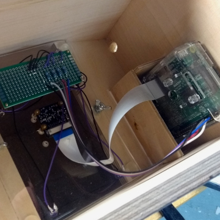
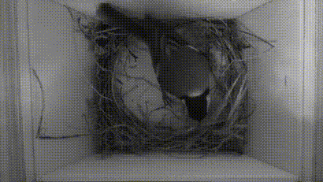
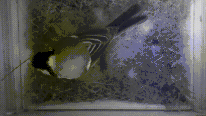
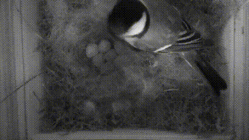

[](LICENSE)
[](https://github.com/elias-lange/birdwatch/actions/workflows/lint.yml)

# Birdwatch

Dieses Repository enthält zwei Python-Skripte `birdwatch_camera.py` und `birdwatch_server.py` zum Aufzeichnen und Speichern von Fotos und Videos von einer Raspberry Pi Camera, die ich mit meinem Vater zur Überwachung einer Vogelfamilie in einem selbstgebauten Vogelhaus programmiert habe.

* [Das Vogelhaus](#das-vogelhaus)
* [Die Python-Skripte](#die-python-skripte)
* [Tipps](#tipps)
* [Beispiel-Videos](#beispiel-videos)

## Das Vogelhaus

Das Foto links zeigt das Vogelhaus während des Baus, vor dem Anstrich und dem Bekleben mit Dachpappe. Die Technik verbirgt sich hinter dem dreieckigen Brett oberhalb des Einfluglochs. Das Foto rechts zeigt diese Technik. Die kleine Platine in der Mitte ist die Kamera - eine Raspberry Pi NoIR Camera V2, also ohne Infrarot-Filter. Die größere Platine ist mit Vorwiderständen für vier Infrarot-LEDs bestückt und mit vier GPIO-Ports des Raspberry Pi verbunden.

 

Mittels der Infrarot-LEDs kann das Innere unsichtbar beleuchtet und somit auch bei absoluter Dunkelheit Aufnahmen von den Vögeln gemacht werden.

## Die Python-Skripte

Die Skripte sind so aufgebaut, dass sie auf zwei Rechner verteilt werden können:

1. Einen Raspberry Pi mit Raspberry Pi Camera im Vogelhaus, der abwechselnd ein Foto und ein 30-sekündiges Video aufnimmt.
2. Ein weiterer Linux-basierter Rechner, der die Fotos und Videos dauerhaft speichert.

Das Skript `birdwatch_camera.py` für den Raspberry Pi überträgt die aufgenommenen Fotos und Videos per MQTT-Protokoll an den zweiten Rechner über die MQTT-Topics

* `birdwatch` für die Fotos und
* `birdwatch/video` für die Videos.

Auf einem dritten Topic `birdwatch/debug` werden Statusinformationen von beiden Rechnern (d.h. den Skripten) übertragen. Durch die Verwendung von MQTT können die Daten einfach auf weiteren Rechnern oder mit geeigneten Smartphone-Apps angezeigt werden.

Das Präfix `birdwatch` in den Topic-Namen kann einfach per Kommandzeilenargument geändert werden.

Das Skript `birdwatch_camera.py` lauscht auf einem vierten Topic `birdwatch/ir_leds`. Empfängt es eine `"1"`, so aktiviert es die GPIO-Pins für die Infrarot-LEDs. Bei `"0"` werden sie wieder ausgeschaltet.

**birdwatch_camera.py.** Das Python-Skript liegt in [`scripts/birdwatch_camera.py`](scripts/birdwatch_camera.py) und bietet folgende Optionen:

```
usage: birdwatch_camera.py [-h] [--host HOST] [--topic TOPIC] [--tmp TMP]

Birdwatch camera service.

optional arguments:
  -h, --help     show this help message and exit
  --host HOST    MQTT host name or IP (default=192.168.1.1)
  --topic TOPIC  topic name (default=birdwatch)
  --tmp TMP      path for temporary storage of video/photo (default=/tmp)
```

**birdwatch_server.py.** Das Python-Skript für den zweiten Linux-Rechner zur dauerhaften Speicherung der Fotos und Videos findet sich in [`scripts/birdwatch_server.py`](scripts/birdwatch_server.py) und bietet folgende Optionen:

```
usage: birdwatch_server.py [-h] [--host HOST] [--topic TOPIC]
                           [--storage STORAGE]

Birdwatch server service.

optional arguments:
  -h, --help         show this help message and exit
  --host HOST        MQTT host name or IP (default=192.168.1.1)
  --topic TOPIC      topic name (default=birdwatch)
  --storage STORAGE  path for permanent storage of video/photo
                     (default=/samba/public)
```

Die Fotos und Videos werden jeden Tag in einem neuen Ordner `YYYY-MM-DD` abgespeichert, mit Namen `image_YYYY-MM-DD_HH-MM-SS.jpg` bzw. `video_YYYY-MM-DD_HH-MM-SS.mp4`. Videos werden vor der finalen Speicherung automatisch mit [ffmpeg](https://www.ffmpeg.org/) in das MP4-Format konvertiert.

## Tipps

* Die aktuell und zuletzt aufgenommenen Fotos und Videos werden von [`scripts/birdwatch_camera.py`](scripts/birdwatch_camera.py) kurzzeitig in einem Tmp-Ordner gespeichert. Um die Zahl der Speicherzugriff auf die SD-Karte zu minimieren empfiehlt sich die Verwendung einer [RAM-Disk](https://wiki.ubuntuusers.de/RAM-Disk_erstellen/). Der Pfad zur RAM-Disk muss dann über die Option `--tmp` mitgegeben werden.
* Zur Abfrage des letzten Fotos und der Statusmeldungen von einem Android-basierten Smartphone aus, haben wir gute Erfahrungen mit der App [MQTT Dash](https://play.google.com/store/apps/details?id=net.routix.mqttdash) gemacht.
* Im Ordner [systemd-config](systemd-config/) finden sich Vorlagen um `birdwatch_camera.py` und `birdwatch_server.py` als Systemd-Dienste einzurichten und beim Boot automatisch zu starten. Die Vorlagen sind mit sudo-Berechtigung jeweils nach `/etc/systemd/system` zu kopieren, anzupassen und dann mit `sudo systemctl enable birdwatch_camera.service` bzw. `sudo systemctl enable birdwatch_server.service` zu aktivieren.

## Beispiel-Videos

Das folgende Video zeigt einen Elternvogel beim frühen Nestbau:



Nun ist das Nest fast fertig:



Die Vogelmama hat acht Eier gelegt und brütet sie nun aus:


