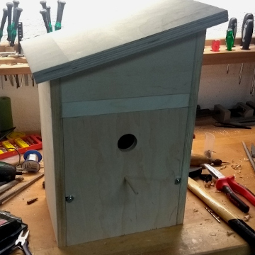

# Birdwatch

Dieses Repository enthält zwei Python-Skripte zum Aufzeichnen und Speichern von Fotos und Videos von einer RasPi-Kamera, die ich mit meinem Vater zur Überwachung einer Vogelfamilie in einem selbstgebauten Vogelhaus programmiert habe.

## Vogelhaus

Das Foto links zeigt das Vogelhaus während des Baus, vor dem Anstricht und dem Bekleben mit Dachpappe. Die Technik verbirgt sich hinter dem dreieckigen Brett oberhalb des Einfluglochs. Das Foto rechts zeigt diese Technik. Die kleine Platine in der Mitte ist die Kamera - eine Raspberry Pi NoIR Camera V2, also ohne Infrarot-Filter. Die größere Platine ist mit Vorwiderständen für vier Infrarot-LEDs bestückt und mit vier GPIO-Ports des Raspberry Pi verbunden.

 

Mittels der Infrarot-LEDs kann das Innere unsichtbar beleuchtet und somit auch bei absoluter Dunkelheit Aufnahmen von den Vögeln gemacht werden.

## Beispiel

Das folgende Video zeigt einen Elternvogel während des Nestbaus.

